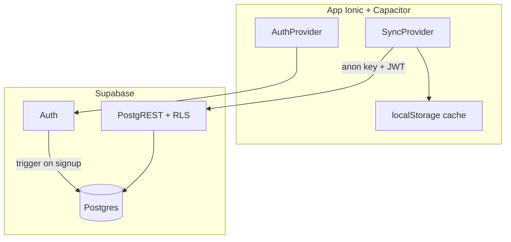

# Supabase — Trilho

Backend completo para auth, sync multi-dispositivo e persistência na nuvem.

**Projeto remoto:** `qellobflykthabmauicb` (região `us-east-2`)  
**URL:** `https://qellobflykthabmauicb.supabase.co`

---

## Arquitetura



| Modo | Comportamento |
|------|---------------|
| Guest | Só `localStorage` |
| Logado | Cache local + sync debounced (~800 ms) para Postgres |
| 1º login com dados locais | Sheet: importar ou começar do zero |
| Outro aparelho | Pull da nuvem substitui cache |

Detalhes de conflito/offline: [`docs/sync-behavior.md`](./sync-behavior.md)

---

## Mapeamento app → banco

| localStorage / app | Tabela Postgres | Ownership |
|--------------------|-----------------|-----------|
| `trilho:tasks` | `public.tasks` | `user_id = auth.uid()` |
| `trilho:history` | `public.day_history` | PK `(user_id, date)` |
| `trilho:profile` | `public.profiles` | `id = auth.uid()` |
| `trilho:notification-preferences` | `public.notification_preferences` | `user_id = auth.uid()` |
| `trilho:notifications` | `public.notifications` | `user_id = auth.uid()` |

### Enums (espelham TypeScript)

- `task_status` → `TaskStatus`
- `task_priority` → `TaskPriority`
- `notification_type` → `NotificationType`

### Triggers

| Trigger | Função | Quando |
|---------|--------|--------|
| `on_auth_user_created` | `handle_new_user()` | Signup → cria `profiles` + `notification_preferences` |
| `*_set_updated_at` | `set_updated_at()` | UPDATE em profiles, tasks, notification_preferences |

---

## Migrations (ordem)

| Arquivo | Conteúdo |
|---------|----------|
| `20260627173457_initial_schema.sql` | Enums, tabelas, índices, RLS, grants |
| `20260627173903_harden_function_security.sql` | `search_path` em `set_updated_at`, revoke EXECUTE em `handle_new_user` |
| `20260627173929_revoke_rls_auto_enable_rpc.sql` | Revoke EXECUTE em `rls_auto_enable` |
| `20260627183639_delete_own_account.sql` | Função `delete_own_account` (LGPD) |
| `20260627203026_signup_display_name.sql` | `handle_new_user` com `display_name` do signup |
| `20260628022742_profile_nickname.sql` | Coluna `nickname` separada de `display_name` |

Os version IDs devem coincidir com `supabase_migrations.schema_migrations` no remoto — necessário para o check **Supabase Preview** no GitHub.

---

## Setup local

### 1. Variáveis de ambiente

Copie `.env.example` → `.env`:

```bash
VITE_SUPABASE_URL=https://qellobflykthabmauicb.supabase.co
VITE_SUPABASE_ANON_KEY=<anon public key do dashboard>
```

**Nunca** use `service_role` com prefixo `VITE_`.

### 2. CLI

```bash
supabase login
supabase link --project-ref qellobflykthabmauicb
supabase db push          # aplica migrations pendentes
```

Dev local (requer Docker):

```bash
supabase start
supabase db reset
```

### 3. Auth no Dashboard (produção)

**Authentication → URL Configuration:**

- Site URL: URL do app (ex. `https://seu-dominio.com` ou `http://localhost:5173` em dev)
- Redirect URLs:
  - `http://localhost:5173/login`
  - `http://127.0.0.1:5173/login`
  - Deep links Capacitor se usar (`capacitor://localhost/login`)

**Authentication → Providers:** email/senha habilitado; confirmação de e-mail conforme produto.

---

## Código relevante

| Arquivo | Papel |
|---------|-------|
| `src/lib/supabase.ts` | Client tipado (`Database`) |
| `src/types/database.ts` | Tipos Postgres |
| `src/lib/auth-context.tsx` | Sessão Supabase Auth |
| `src/lib/sync-context.tsx` | Orquestra pull/push |
| `src/lib/sync/cloud-sync.ts` | CRUD na nuvem |
| `supabase/migrations/` | Schema versionado |

Regenerar tipos (quando schema mudar):

```bash
supabase gen types typescript --project-id qellobflykthabmauicb > src/types/database.ts
```

---

## Segurança

- RLS **ENABLED** em todas as 5 tabelas; policies `TO authenticated` com `auth.uid()`.
- Advisor Supabase: **0 avisos** (pós-hardening).
- Checklist: [`docs/security-supabase-checklist.md`](./security-supabase-checklist.md)
- Auditoria Fase 11: [`docs/security-audit-fase-11-complete.md`](./security-audit-fase-11-complete.md)
- Gate prompt: [`.cursor/plans/auditoria_supabase_gate.prompt.md`](../.cursor/plans/auditoria_supabase_gate.prompt.md)

---

## Fora de escopo (adiado)

- Edge Functions / push remoto (FCM/APNs)
- Supabase Storage (avatars são URLs DiceBear, não arquivos)
- Realtime subscriptions (MVP usa pull no login/reopen)
- Ícones push iOS/Android (Fase 8.5 / 11.3b)
